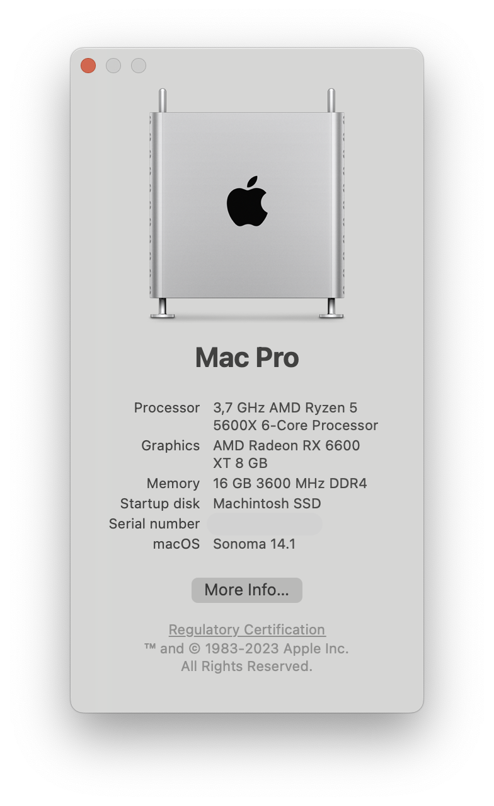
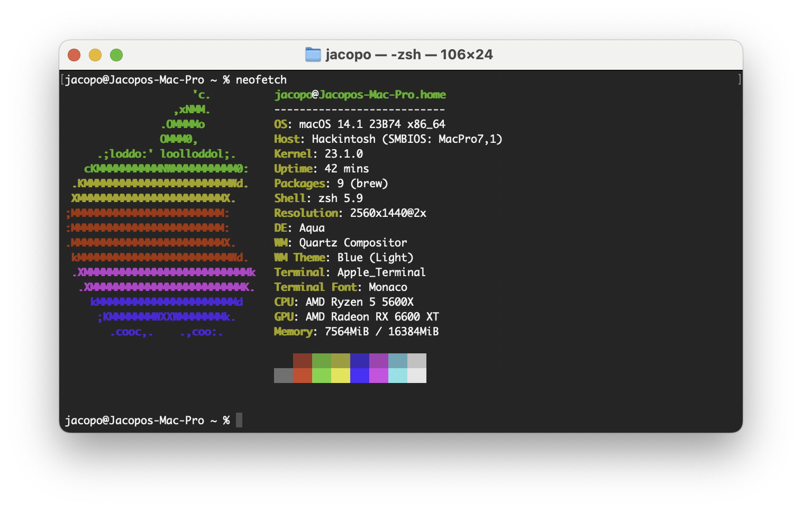

# OpenCore EFI Setup for Asus ROG B550-I Strix, Ryzen 5600x and Radeon RX 6600 XT

OpenCore's EFI folder foder AMD based Hackintosh.

## System Specifications

| Name               | Model                            |
| ------------------ | -------------------------------- |
| **Motherboard**    | ASUS ROG B550-I Strix            |
| **CPU**            | AMD Ryzen 5600X                  |
| **GPU**            | XFX AMD Radeon RX 6000 XT 8GB    |
| **RAM**            | Corsair 2x8 DDR4 3600 MHz        |
| **SSD**            | SanDisk SanDisk SDSSDH3 250G     |
| **Ethernet**       | Intel Ethernet Controller I115-V |
| **WiFi/Bluetooth** | Intel Wi-Fi 6 AX2000             |

### Software

- **OpenCore:** v0.9.5
- **macOS:** v14.1 Sonoma

## Known Issues

- Instable bluetooth
- Front jack not working
